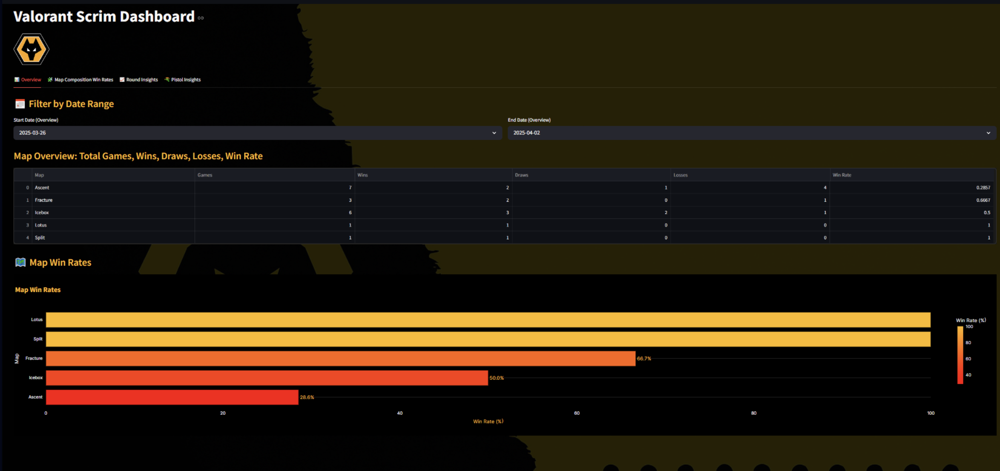

# 🟡 Wolves Esports - Valorant Scrim Dashboard

This is a custom-built analytics dashboard created for **Wolves Esports Valorant** to analyze scrim performance in depth, featuring:

- 📊 **Map Win Rates & Round Insights**
- 🧩 **5-Agent Composition Win Rates**
- 🔫 **Pistol Round & 2nd Round Conversion Rates**
- 📈 **Post-Plant Success vs Retake Stats**
- 🔢 **Player Agent Stats (with filtering)**

Built using **Streamlit**, **Plotly**, and custom CSS to match Wolves' black and yellow branding.

---

## 🗂️ Features Breakdown

### 📊 Overview Tab
- Date filter range
- Map-wise win/draw/loss breakdown
- Horizontal bar chart for win rates

### 🧩 Map Composition Win Rates
- Select map to view top 5-agent comps
- Tracks win/draw/loss results for each comp
- Styled like rib.gg with agent icons

### 📈 Round Insights
- Filter by date and map
- Attack vs Defense WR based on starting side
- Highlighted table for quick insights
- 🔄 Post-Plant Success: stacked bar chart (Attack vs Retake)

### 🔫 Pistol Insights
- Win rates for first and second pistols by map
- 🍰 2nd round conversion pie charts:
  - WW/WL: conversion after pistol win
  - LL/LW: rebound after pistol loss

### 🔢 Player Agent Stats
- Select any player and filter by date/map
- Aggregated stats by agent: Rounds, K/D, ACS, FK, Plants, etc.
- Auto-averaged view (not raw match-by-match)

---

## 🛠️ Tech Stack
- **Streamlit** for interactive UI
- **Plotly** for dynamic charts
- **Pandas** for all data handling
- **Excel**-friendly CSV format for easy updates
- **Wolves theme** with black + #FDB913 yellow

---

## 🚀 Getting Started

1. Clone the repo
```bash
git clone https://github.com/yourusername/wolves-valorant-dashboard.git
cd wolves-valorant-dashboard
```

2. Install dependencies
```bash
pip install -r requirements.txt
```

3. Run the dashboard
```bash
streamlit run streamlit_dashboard.py
```

Make sure `cleaned_score.csv`, `form.csv`, and the agent icons are present.

---

## 📁 Data Structure

### cleaned_score.csv
- Map, Date, Outcome, Start, First Pistol, Second Pistol
- Atk_PP_Success, Def_PP_Success
- Atk 2nd, Def 2nd

### form.csv
- Player, Date, Agent, Map (Column 1), Rounds, Kills, Deaths, Assists, FK, ACS, Plants, etc.
- Tracked 1 row per player per match

---

## 📸 Screenshots



---

## 📣 Credits

Built and maintained by **Ominous**  
📍 Analyst @ Wolves Esports  
🐦 [@_SushantJha](https://x.com/_SushantJha)

---

## 📌 TODO / Future Work
- Add heatmaps or agent radar charts
- Export summary PDFs for weekly reports

---

## 🧪 Automated testing (AUTOTEST)

For local headless checks and CI runs we added a small, opt-in bypass to the development branch `dev-autotest` that lets automated scripts skip the interactive login step.

Key points:
- The main codebase (branch `anyquestions` / `main`) is unchanged — the bypass is only committed to `dev-autotest`.
- The bypass activates only when the environment variable `AUTOTEST` is set to `1`.

Local quick run (start a headless Streamlit instance that auto-skips login):

```powershell
$env:AUTOTEST='1'; & 'C:/Users/you/AppData/Local/Programs/Python/Python3XX/python.exe' -m streamlit run "d:\Repo\valorant-comp-dashboard\streamlit_dashboard.py" --server.headless true --server.port 8503
```

CI example (GitHub Actions) — run headless checks with AUTOTEST enabled:

```yaml
name: CI - Headless checks

on: [push]

jobs:
  headless-checks:
    runs-on: ubuntu-latest
    steps:
      - uses: actions/checkout@v4
      - name: Set up Python
        uses: actions/setup-python@v4
        with:
          python-version: '3.11'
      - name: Install dependencies
        run: |
          python -m pip install --upgrade pip
          pip install -r requirements.txt
      - name: Run headless automated checks
        env:
          AUTOTEST: '1'
        run: |
          python -c "from playwright.sync_api import sync_playwright; print('Playwright available')"
          # run your test script here, e.g.:
          python tests/run_headless_checks.py
```

Notes:
- If you want to keep the bypass in the repo, keep it confined to `dev-autotest` and only merge to main after removing it (or keep it gated behind `AUTOTEST`).
- The repo contains small snapshot files generated during development; you can safely remove them or add them to `.gitignore` if they are not needed.


